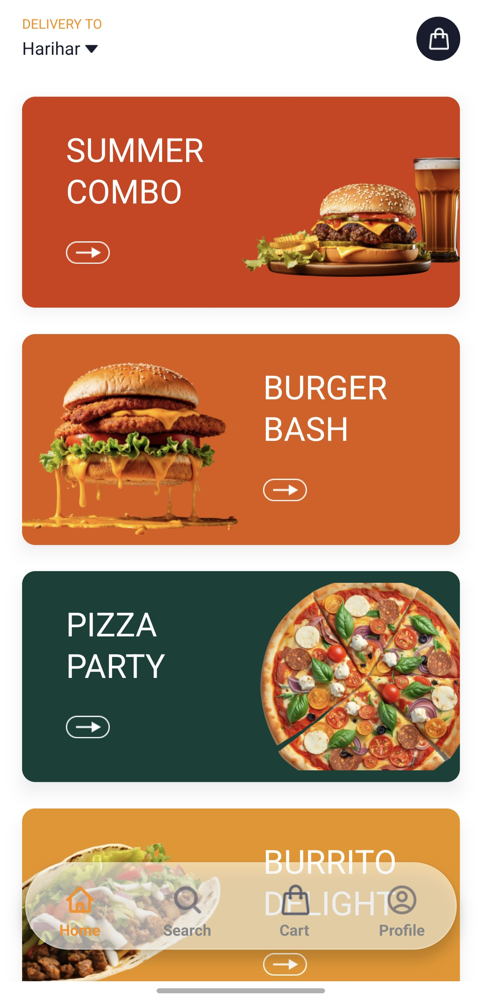
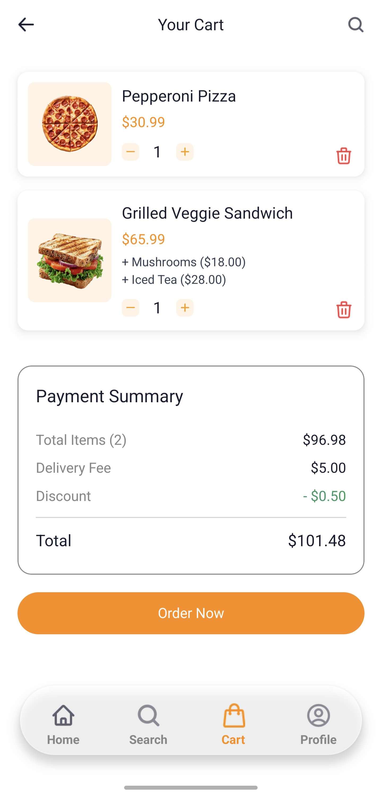
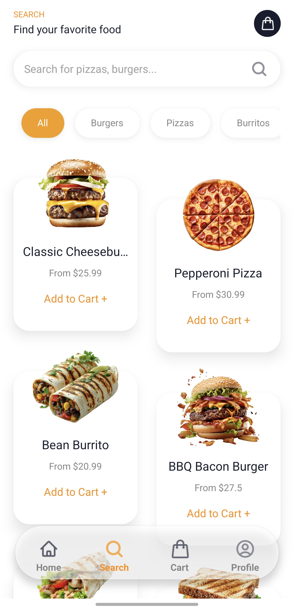

# Food Ordering App 🍔

A mobile food ordering application built with **Expo**, **React Native**, and **Appwrite** as the backend. This project allows users to browse menus, search items, add to cart, and manage their profiles.

---

## Table of Contents

- [Tech Stack](#tech-stack)
- [AI Usage](#ai-usage)
- [App Screenshots](#screenshots)
- [Getting Started](#getting-started)
- [Learn More](#learn-more)
- [Community](#community)

---

## Tech Stack

This app is built using the following technologies:

**Frontend:**

- [Expo](https://expo.dev) – framework for universal React apps
- [React Native](https://reactnative.dev) – mobile app framework
- [React Navigation](https://reactnavigation.org) – navigation library
- [NativeWind](https://www.nativewind.dev/) – Tailwind CSS for React Native
- [Zustand](https://zustand-demo.pmnd.rs/) – state management
- [Expo Image & Image Picker](https://docs.expo.dev/versions/latest/sdk/image/) – handling images
- [Expo Haptics](https://docs.expo.dev/versions/latest/sdk/haptics/) – vibration feedback
- [Expo File System](https://docs.expo.dev/versions/latest/sdk/filesystem/) – file management
- [Expo Splash Screen & System UI](https://docs.expo.dev/) – app launch screen
- [React Native Appwrite](https://appwrite.io/docs) – backend SDK for authentication and database
- [CLSX](https://github.com/lukeed/clsx) – conditional className management
- [Sentry](https://sentry.io/) – error tracking

**Backend:**

- [Appwrite](https://appwrite.io) – backend as a service (BaaS)

**Utilities:**

- TailwindCSS with `prettier-plugin-tailwindcss`
- ESLint & TypeScript

---

## 🤖 AI Usage

This project incorporated **AI-assisted development** to enhance productivity and streamline implementation. The following details explain where and how AI was involved:

### 🔧 Model / Tool Used

- **ChatGPT** — utilized to scaffold logic, generate reusable code structures, and assist with documentation.

### 🧩 AI-Generated Components

The following parts of the project were developed or assisted by AI:

- **`appwrite.js`** – Appwrite integration (authentication, client setup, helper functions)
- **Zustand store code** – Cart store, user store, and persistence helpers
- **UI components & layouts** – Header, cart item, product card, search page, profile screens
- **Business logic & utilities** – Price calculations, quantity updates, and memoized selectors
- **Documentation** – README content, developer notes, and setup instructions

### ⚙️ Handling AI-Generated Code

AI outputs served as **scaffolding and development accelerators**. Before using in production, ensure:

- All generated code is **reviewed**, **tested**, and **verified** for correctness and security.
- No sensitive data (API keys, credentials) is committed to the repository.
- Use **environment variables** or secure storage for secrets.

### 🗂️ Reproducibility & Transparency

To maintain transparency and reproducibility:

- Store AI prompts and generated snippets in a dedicated folder — for example: `/docs/ai-prompts/`
- This helps reviewers and contributors understand what was requested and produced by AI.

---

## App Screenshots

| Sign Up Page                 | Sign In Page                 |
| ---------------------------- | ---------------------------- |
|  |  |

| Home Page                  | Cart Page                  |
| -------------------------- | -------------------------- |
|  |  |

| Search Page                    | Profile Page                     |
| ------------------------------ | -------------------------------- |
|  |  |

---

## Getting Started

1. Clone the repository:

```bash
git clone <repo-url>
cd food-ordering
npx expo start --clear
```
